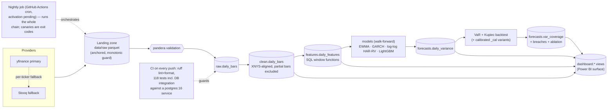

# Volatility Risk Engine

[](https://github.com/aakrisht-26/volatility-risk-engine/actions/workflows/ci.yml)
[](https://github.com/aakrisht-26/volatility-risk-engine/actions/workflows/nightly.yml)

Next-day **volatility forecasting and Value-at-Risk backtesting** for a basket of US
equities and indices: a PostgreSQL pipeline from raw OHLCV to walk-forward forecasts
(EWMA → GARCH(1,1) → HAR-RV → LightGBM), 1-day parametric VaR with Kupiec coverage
tests, and a dashboard-ready SQL surface. Every result below regenerates from the
database by one command.

> **Positioning.** This is a risk analytics project. The intellectual core is the
> distinction that volatility is predictable while returns are not — we forecast risk,
> never direction. Nothing in this repository is a trading signal, a price prediction,
> or investment advice.

## Results — forecast accuracy (ablation)

Five models, walk-forward only (expanding window, ≥3 years of training sessions,
monthly refits) — no random splits, no tuning; every forecast uses information through
the previous session. `lgbm_vix` adds lagged ^VIX level/change as exogenous regressors.

<!-- ABLATION:BEGIN -->
Evaluation set: the per-ticker INTERSECTION of every model's forecast dates — identical for all models by construction: n = 1762 sessions per ticker, 2019-07-15 to 2026-07-17. Realized-variance proxy: Garman-Klass. Lower is better; row-best in bold.

**QLIKE (primary)**

| ticker | ewma_094 | garch_11 | har_rv | lgbm | lgbm_vix |
|---|---|---|---|---|---|
| AAPL | 0.4199 | 0.3945 | **0.3001** | 0.4338 | 0.4075 |
| JPM | 0.3865 | 0.3312 | **0.2842** | 0.4513 | 0.3907 |
| MSFT | 0.4060 | 0.3793 | **0.2820** | 0.4102 | 0.3755 |
| NVDA | 0.4046 | 0.4140 | **0.2846** | 0.3723 | 0.3550 |
| TSLA | 0.3974 | 0.4524 | **0.2746** | 0.3424 | 0.3393 |
| XOM | 0.3371 | 0.3295 | **0.2475** | 0.3485 | 0.3328 |
| ^GSPC | 0.5757 | 0.5057 | **0.3781** | 0.5111 | 0.4493 |
| **AVERAGE** | 0.4182 | 0.4009 | **0.2930** | 0.4099 | 0.3786 |

**RMSE, annualized-vol percentage points (secondary)**

| ticker | ewma_094 | garch_11 | har_rv | lgbm | lgbm_vix |
|---|---|---|---|---|---|
| AAPL | 14.10 | 12.77 | **9.41** | 10.07 | 9.93 |
| JPM | 13.82 | 10.57 | **9.14** | 11.07 | 10.82 |
| MSFT | 13.03 | 11.60 | **8.37** | 9.53 | 9.48 |
| NVDA | 21.62 | 21.03 | **14.56** | 15.38 | 15.25 |
| TSLA | 27.09 | 28.58 | **18.50** | 19.36 | 18.94 |
| XOM | 12.94 | 12.24 | **9.65** | 10.96 | 10.69 |
| ^GSPC | 10.39 | 8.94 | **5.86** | 6.38 | 6.13 |
| **AVERAGE** | 16.14 | 15.11 | **10.78** | 11.82 | 11.61 |

*QLIKE(h, f) = h/f - ln(h/f) - 1 (Patton-class robust loss, normalized to 0 at f = h); dimensionless, lower is better. RMSE is in annualized-volatility percentage points, i.e. rmse(100·sqrt(252·h), 100·sqrt(252·f)). h = realized Garman-Klass variance, f = forecast; both are daily variances in return units.*
<!-- ABLATION:END -->

**Modeling note (why the regressions fit log variance).** v1 fit the regression models
on variance *levels*; in calm regimes they emitted a handful of near-zero (HAR: even
negative, floored) forecasts, and QLIKE — asymmetric by design, punishing variance
under-forecasts hardest, which is the right asymmetry for risk work — blew up on
exactly those dates (JPM HAR-RV: 755.6 with them, 0.29 without). v2 therefore fits
`ln(variance)` and maps back with the lognormal half-variance correction
`exp(m + s^2/2)` (s^2 = training-residual variance in log space, re-estimated at each
refit); raw exponentiation would target the conditional *median* and systematically
under-forecast the mean — the direction QLIKE punishes most. HAR-RV uses Corsi's
log-log form (ln components as regressors, coefficients are elasticities): a log
target over *level* features put spike-day component values straight into the
exponent and produced astronomical over-forecasts — QLIKE's logarithmic over-forecast
penalty barely moved while RMSE detonated, the exact mirror image of the v1 pathology.
LightGBM keeps level features (trees split, they don't extrapolate). The 1e-8
positivity floor remains as a canary only: with log-space fits it should never bind
(expected floored count: 0).

**Proxy robustness** (checked 2026-07-12 on the then-current window). Re-scored against
the noisier squared-return proxy (kept in the features layer for exactly this check),
the ranking flips: GARCH leads (average QLIKE 1.54) and HAR-RV's sweep does not persist
(1.67). The two proxies target different variances — Garman-Klass measures the intraday
range and excludes the overnight gap, while close-to-close squared returns include it —
so each model family wins on the target it trains on. The forecast set feeding the VaR
layer is judged against the VaR-relevant (close-to-close) target, not this table alone.

## Results — VaR coverage (Kupiec backtest)

1-day parametric VaR at 95% and 99% for every model, backtested on the same per-ticker
intersection window as the ablation (n and span are stated in the results block, which
regenerates with the data).

**Method.** VaR_α(d) = z_α · sqrt(var_forecast(d)), assuming a **zero-mean** normal
1-day return — over one trading day the drift (~1e-4) is negligible next to volatility
(~1e-2), the standard 1-day parametric-VaR assumption. z₉₅ = 1.645, z₉₉ = 2.326. VaR is
a positive loss magnitude in log-return units. **Breach convention:** session d breaches
when the realized close-to-close log return r_d < −VaR_α(d) — the long-position loss
tail. Under the model P(breach) = 1 − α exactly, so expected breaches are 5% and 1% of
the window (exact counts in the tables).

**Pre-registered predictions** (committed before any results were computed — see git
history; the results block below was empty in the registering commit):

1. **(i)** The GK-target models (`har_rv`, `lgbm`, `lgbm_vix`) **under-cover at both
   levels** — their σ is *session-range* (Garman–Klass) volatility, which omits the
   overnight gap, so it understates close-to-close risk and produces more breaches than
   nominal.
2. **(ii)** **All models under-cover at 99%** — a normal quantile cannot reach the fat
   tails of real returns, so the 99% VaR is too small for every model.
3. **(iii)** **GARCH and EWMA sit closest to nominal at 95%** — their σ is already
   close-to-close, so at the level where the normal tail is least wrong they should be
   near-calibrated.

**Confirmation criterion for (i)** (pre-registered): the three GK-target models'
*average observed 95% breach rate* ≥ 6.0% (a ≥20% relative excess over the 5% nominal).
If met, the runner builds calibrated variants (`har_rv_cal`, `lgbm_cal`, `lgbm_vix_cal`)
that multiply each session-range variance by a per-ticker ratio
c = mean(r²)/mean(gk_var), estimated on **training data only** at each monthly refit
(expanding window, no look-ahead), converting session-range variance to close-to-close
variance, and re-runs Kupiec on them.

<!-- VAR:BEGIN -->
**Outcomes vs pre-registered predictions:**

- (i) GK-target models under-cover at 95%: **CONFIRMED** — avg breach rate 9.8% vs 5% nominal, all reject Kupiec.
- (ii) All base models under-cover at 99%: **CONFIRMED** — every model's avg 99% rate exceeds 1% (least-bad 1.8%); the normal-quantile fat-tail limitation, measured.
- (iii) GARCH/EWMA closest to nominal at 95%: **CONFIRMED** — their avg 95% rate 5.3% is 0.3pp off nominal vs 4.8pp for the GK-target models.

Backtest window: per-ticker intersection of every base model's forecast dates, n = 1762 sessions, 2019-07-15 to 2026-07-17. Cells show observed breaches (rate); † = Kupiec rejects correct coverage at 5%.

**95% VaR** — expected 88.1 breaches / 1762 sessions

| ticker | ewma_094 | garch_11 | har_rv | lgbm | lgbm_vix |
|---|---|---|---|---|---|
| AAPL | 88 (5.0%) | 85 (4.8%) | 135 (7.7%) † | 186 (10.6%) † | 176 (10.0%) † |
| JPM | 100 (5.7%) | 97 (5.5%) | 129 (7.3%) † | 167 (9.5%) † | 156 (8.9%) † |
| MSFT | 97 (5.5%) | 101 (5.7%) | 151 (8.6%) † | 193 (11.0%) † | 178 (10.1%) † |
| NVDA | 86 (4.9%) | 78 (4.4%) | 139 (7.9%) † | 192 (10.9%) † | 183 (10.4%) † |
| TSLA | 89 (5.1%) | 75 (4.3%) | 146 (8.3%) † | 182 (10.3%) † | 179 (10.2%) † |
| XOM | 100 (5.7%) | 97 (5.5%) | 146 (8.3%) † | 186 (10.6%) † | 190 (10.8%) † |
| ^GSPC | 108 (6.1%) † | 110 (6.2%) † | 166 (9.4%) † | 233 (13.2%) † | 223 (12.7%) † |
| **AVERAGE** | 95.4 | 91.9 | 144.6 | 191.3 | 183.6 |
| **Kupiec rejects (/7)** | 1 | 1 | 7 | 7 | 7 |

**99% VaR** — expected 17.6 breaches / 1762 sessions

| ticker | ewma_094 | garch_11 | har_rv | lgbm | lgbm_vix |
|---|---|---|---|---|---|
| AAPL | 40 (2.3%) † | 31 (1.8%) † | 49 (2.8%) † | 95 (5.4%) † | 90 (5.1%) † |
| JPM | 44 (2.5%) † | 38 (2.2%) † | 56 (3.2%) † | 86 (4.9%) † | 76 (4.3%) † |
| MSFT | 33 (1.9%) † | 38 (2.2%) † | 64 (3.6%) † | 102 (5.8%) † | 94 (5.3%) † |
| NVDA | 23 (1.3%) | 16 (0.9%) | 54 (3.1%) † | 83 (4.7%) † | 74 (4.2%) † |
| TSLA | 30 (1.7%) † | 29 (1.6%) † | 62 (3.5%) † | 101 (5.7%) † | 91 (5.2%) † |
| XOM | 37 (2.1%) † | 36 (2.0%) † | 60 (3.4%) † | 88 (5.0%) † | 96 (5.4%) † |
| ^GSPC | 42 (2.4%) † | 40 (2.3%) † | 76 (4.3%) † | 121 (6.9%) † | 117 (6.6%) † |
| **AVERAGE** | 35.6 | 32.6 | 60.1 | 96.6 | 91.1 |
| **Kupiec rejects (/7)** | 6 | 6 | 7 | 7 | 7 |

**Calibrated GK-target variants** (session-range variance rescaled to close-to-close by the walk-forward, training-only ratio c = mean(r^2)/mean(gk_var)).

*95% VaR — expected 88.1 breaches*

| ticker | har_rv_cal | lgbm_cal | lgbm_vix_cal |
|---|---|---|---|
| AAPL | 65 (3.7%) † | 111 (6.3%) † | 101 (5.7%) |
| JPM | 73 (4.1%) | 103 (5.8%) | 97 (5.5%) |
| MSFT | 89 (5.1%) | 123 (7.0%) † | 119 (6.8%) † |
| NVDA | 70 (4.0%) † | 94 (5.3%) | 88 (5.0%) |
| TSLA | 81 (4.6%) | 118 (6.7%) † | 112 (6.4%) † |
| XOM | 96 (5.4%) | 123 (7.0%) † | 125 (7.1%) † |
| ^GSPC | 78 (4.4%) | 118 (6.7%) † | 117 (6.6%) † |
| **AVERAGE** | 78.9 | 112.9 | 108.4 |
| **Kupiec rejects (/7)** | 2 | 5 | 4 |

*99% VaR — expected 17.6 breaches*

| ticker | har_rv_cal | lgbm_cal | lgbm_vix_cal |
|---|---|---|---|
| AAPL | 24 (1.4%) | 41 (2.3%) † | 43 (2.4%) † |
| JPM | 31 (1.8%) † | 46 (2.6%) † | 40 (2.3%) † |
| MSFT | 31 (1.8%) † | 51 (2.9%) † | 48 (2.7%) † |
| NVDA | 14 (0.8%) | 30 (1.7%) † | 31 (1.8%) † |
| TSLA | 25 (1.4%) | 40 (2.3%) † | 44 (2.5%) † |
| XOM | 30 (1.7%) † | 49 (2.8%) † | 58 (3.3%) † |
| ^GSPC | 29 (1.6%) † | 60 (3.4%) † | 53 (3.0%) † |
| **AVERAGE** | 26.3 | 45.3 | 45.3 |
| **Kupiec rejects (/7)** | 4 | 7 | 7 |
<!-- VAR:END -->

### Independence of breaches (Christoffersen)

Kupiec tests whether breaches happen at the **right rate**; it is blind to *when*.
Eighty-eight breaches spread evenly and eighty-eight all inside one crisis month score
identically. Christoffersen's LR_ind fits a first-order Markov chain to the breach
series and asks whether a breach today is more likely **given a breach yesterday**
(H0: independence, χ²(1)); LR_cc = LR_uc + LR_ind tests rate and clustering jointly
(χ²(2)). Same models, same n = 1,762 intersection window.

**Pre-registered predictions** (Aakrisht's, committed before the statistics were
computed — the results block below was empty in the registering commit):

1. **(i)** GARCH-family models pass independence **more often** than the GK-target
   models, since a conditional-variance recursion adapts within crisis windows.
2. **(ii)** Failures concentrate at **95%**, where breach counts are large enough for
   the test to have power.
3. **(iii)** At **99%** the low counts leave the test underpowered — a non-rejection
   there is not evidence of independence.

<!-- INDEPENDENCE:BEGIN -->
**Outcomes vs pre-registered predictions:**

- (i) GARCH-family models pass independence more often: **CONFIRMED** — ewma_094 + garch_11 reject 1/28 tests, the GK-target models 16/42. **Population: the 5 BASE variants only** (2 + 3 models x 7 tickers x 2 levels = 28 + 42 tests), because that is the population the prediction was registered over — the _cal and _t variants did not exist yet. These two denominators therefore will NOT be found by adding up the tables below, which cover all variants; every other number in this section will be.
- (ii) Failures concentrate at 95%: **CONFIRMED** — 27 rejections at 95% vs 21 at 99% (directional, not overwhelming).
- (iii) The 99% test is underpowered: **supported** — median n_11 at 99% is 1, so most series carry almost no information about clustering; non-rejection there is not evidence of independence.

**Surprise worth stating:** only **27 of 48** rejections are clustering (pi_11 > pi_01). The other **21** are *anti*-clustering — breaches spaced too regularly to be independent. Rejection is therefore not a synonym for clustering, and an eyeball of the breach chart would likely not flag the anti-clustered cases at all.

**Population for every figure below except verdict (i):** all 16 model variants x 7 tickers x 2 levels = 224 independence tests. Both tables render all of them, so their reject columns add up to the totals quoted above.

Cells show **n_11 / p-value**: n_11 is the count of breaches immediately following a breach (the clustering signal), p is Christoffersen's LR_ind (chi-square(1), H0 = independence). ‡ = independence rejected at 5%. The two right-hand columns count each variant's rejections across the seven tickers — of independence, and of the joint conditional-coverage test LR_cc = LR_uc + LR_ind (chi-square(2)) — and the TOTAL row is their sum.

**95% VaR — independence**

| model | AAPL | JPM | MSFT | NVDA | TSLA | XOM | ^GSPC | ind rejects | LR_cc rejects |
|---|---|---|---|---|---|---|---|---|---|
| ewma_094 | 6 / p=0.444 | 10 / p=0.079 | 5 / p=0.874 | 6 / p=0.383 | 1 / p=0.039 ‡ | 9 / p=0.169 | 7 / p=0.877 | 1 | 0 |
| ewma_094_t | 7 / p=0.404 | 10 / p=0.229 | 6 / p=0.951 | 6 / p=0.768 | 7 / p=0.548 | 10 / p=0.155 | 9 / p=0.607 | 0 | 3 |
| garch_11 | 2 / p=0.230 | 8 / p=0.253 | 2 / p=0.056 | 3 / p=0.794 | 1 / p=0.138 | 5 / p=0.874 | 7 / p=0.958 | 0 | 0 |
| garch_11_t | 4 / p=0.554 | 11 / p=0.074 | 3 / p=0.106 | 3 / p=0.720 | 7 / p=0.688 | 8 / p=0.476 | 7 / p=0.652 | 0 | 4 |
| har_rv | 11 / p=0.828 | 17 / p=0.015 ‡ | 9 / p=0.208 | 9 / p=0.507 | 5 / p=0.013 ‡ | 13 / p=0.781 | 14 / p=0.641 | 2 | 7 |
| har_rv_t | 12 / p=0.779 | 17 / p=0.043 ‡ | 9 / p=0.160 | 10 / p=0.467 | 11 / p=0.046 ‡ | 13 / p=0.904 | 16 / p=0.910 | 2 | 7 |
| lgbm | 24 / p=0.285 | 26 / p=0.009 ‡ | 22 / p=0.837 | 12 / p=0.019 ‡ | 11 / p=0.032 ‡ | 24 / p=0.285 | 35 / p=0.378 | 3 | 7 |
| lgbm_t | 28 / p=0.107 | 29 / p=0.022 ‡ | 22 / p=0.865 | 14 / p=0.033 ‡ | 29 / p=0.385 | 27 / p=0.295 | 38 / p=0.459 | 2 | 7 |
| lgbm_vix | 16 / p=0.670 | 25 / p=0.002 ‡ | 15 / p=0.422 | 11 / p=0.028 ‡ | 5 / p=0.000 ‡ | 26 / p=0.187 | 25 / p=0.496 | 3 | 7 |
| lgbm_vix_t | 21 / p=0.817 | 28 / p=0.011 ‡ | 17 / p=0.565 | 14 / p=0.059 | 28 / p=0.196 | 28 / p=0.223 | 26 / p=0.270 | 1 | 7 |
| har_rv_cal | 1 / p=0.292 | 8 / p=0.012 ‡ | 2 / p=0.168 | 3 / p=0.893 | 0 / p=0.005 ‡ | 9 / p=0.110 | 6 / p=0.191 | 2 | 3 |
| har_rv_cal_t | 1 / p=0.254 | 10 / p=0.006 ‡ | 2 / p=0.142 | 3 / p=0.948 | 2 / p=0.022 ‡ | 10 / p=0.070 | 7 / p=0.168 | 2 | 3 |
| lgbm_cal | 6 / p=0.681 | 13 / p=0.008 ‡ | 6 / p=0.318 | 3 / p=0.307 | 2 / p=0.008 ‡ | 14 / p=0.065 | 12 / p=0.143 | 2 | 5 |
| lgbm_cal_t | 6 / p=0.576 | 19 / p=0.002 ‡ | 7 / p=0.275 | 3 / p=0.116 | 7 / p=0.036 ‡ | 14 / p=0.218 | 13 / p=0.245 | 2 | 7 |
| lgbm_vix_cal | 6 / p=0.928 | 14 / p=0.001 ‡ | 8 / p=0.987 | 1 / p=0.043 ‡ | 2 / p=0.017 ‡ | 13 / p=0.159 | 8 / p=0.910 | 3 | 5 |
| lgbm_vix_cal_t | 7 / p=0.877 | 15 / p=0.007 ‡ | 8 / p=0.603 | 3 / p=0.211 | 6 / p=0.012 ‡ | 14 / p=0.180 | 10 / p=0.868 | 2 | 5 |
| **TOTAL (16 variants x 7 tickers = 112 tests)** | | | | | | | | **27** | **77** |

**99% VaR — independence**

| model | AAPL | JPM | MSFT | NVDA | TSLA | XOM | ^GSPC | ind rejects | LR_cc rejects |
|---|---|---|---|---|---|---|---|---|---|
| ewma_094 | 2 / p=0.309 | 3 / p=0.122 | 0 / p=0.262 | 0 / p=0.435 | 0 / p=0.308 | 1 / p=0.805 | 2 / p=0.366 | 0 | 6 |
| ewma_094_t | 2 / p=0.091 | 2 / p=0.079 | 0 / p=0.359 | 0 / p=0.588 | 0 / p=0.396 | 1 / p=0.466 | 2 / p=0.190 | 0 | 3 |
| garch_11 | 0 / p=0.292 | 2 / p=0.257 | 1 / p=0.844 | 0 / p=0.588 | 0 / p=0.324 | 1 / p=0.765 | 1 / p=0.923 | 0 | 6 |
| garch_11_t | 0 / p=0.359 | 1 / p=0.366 | 0 / p=0.292 | 0 / p=0.660 | 0 / p=0.415 | 1 / p=0.366 | 1 / p=0.611 | 0 | 2 |
| har_rv | 1 / p=0.737 | 6 / p=0.009 ‡ | 1 / p=0.312 | 2 / p=0.789 | 0 / p=0.033 ‡ | 7 / p=0.004 ‡ | 4 / p=0.687 | 3 | 7 |
| har_rv_t | 1 / p=0.962 | 5 / p=0.004 ‡ | 1 / p=0.512 | 1 / p=0.960 | 0 / p=0.184 | 4 / p=0.036 ‡ | 3 / p=0.698 | 2 | 7 |
| lgbm | 4 / p=0.586 | 10 / p=0.010 ‡ | 5 / p=0.685 | 2 / p=0.267 | 1 / p=0.010 ‡ | 9 / p=0.040 ‡ | 12 / p=0.194 | 3 | 7 |
| lgbm_t | 3 / p=0.756 | 8 / p=0.002 ‡ | 4 / p=0.963 | 1 / p=0.220 | 0 / p=0.010 ‡ | 7 / p=0.034 ‡ | 7 / p=0.534 | 3 | 7 |
| lgbm_vix | 4 / p=0.764 | 11 / p=0.000 ‡ | 3 / p=0.307 | 1 / p=0.150 | 0 / p=0.002 ‡ | 7 / p=0.435 | 8 / p=0.931 | 2 | 7 |
| lgbm_vix_t | 4 / p=0.612 | 5 / p=0.059 | 1 / p=0.175 | 0 / p=0.040 ‡ | 0 / p=0.016 ‡ | 6 / p=0.327 | 6 / p=0.652 | 2 | 7 |
| har_rv_cal | 1 / p=0.335 | 4 / p=0.002 ‡ | 0 / p=0.292 | 0 / p=0.636 | 0 / p=0.396 | 4 / p=0.001 ‡ | 2 / p=0.091 | 2 | 4 |
| har_rv_cal_t | 1 / p=0.224 | 3 / p=0.003 ‡ | 0 / p=0.377 | 0 / p=0.710 | 0 / p=0.456 | 3 / p=0.003 ‡ | 2 / p=0.079 | 2 | 3 |
| lgbm_cal | 1 / p=0.962 | 6 / p=0.001 ‡ | 1 / p=0.669 | 0 / p=0.308 | 0 / p=0.173 | 4 / p=0.056 | 2 / p=0.974 | 1 | 7 |
| lgbm_cal_t | 1 / p=0.574 | 6 / p=0.000 ‡ | 1 / p=0.687 | 0 / p=0.476 | 0 / p=0.262 | 3 / p=0.063 | 2 / p=0.309 | 1 | 6 |
| lgbm_vix_cal | 2 / p=0.396 | 3 / p=0.073 | 1 / p=0.773 | 0 / p=0.292 | 0 / p=0.133 | 3 / p=0.449 | 4 / p=0.096 | 0 | 7 |
| lgbm_vix_cal_t | 2 / p=0.211 | 0 / p=0.308 | 1 / p=0.884 | 0 / p=0.456 | 0 / p=0.233 | 3 / p=0.095 | 3 / p=0.073 | 0 | 6 |
| **TOTAL (16 variants x 7 tickers = 112 tests)** | | | | | | | | **21** | **92** |
<!-- INDEPENDENCE:END -->

### The model crown — settled

**Featured model: `har_rv_cal_t`. Stated benchmark: `garch_11`.** (Ruled 2026-07-22,
after both stretch results separated the two dimensions cleanly.)

On **coverage** — the primary VaR criterion, because coverage is what the risk number
claims to deliver — `har_rv_cal_t` is the best-calibrated model in the project: **95%
breach rate 4.94%** (2/7 tickers reject Kupiec) and **99% 1.26%** (**1/7**, down from
4/7 under the normal quantile). On **independence**, `garch_11` wins outright — **0/7
rejections at both levels** against har_rv_cal's 2/7 — and that is a real advantage, not
a rounding error: breaches arriving in bursts are worse than breaches arriving evenly,
because losses compound faster than capital replenishes. The genuine clustering is
concentrated in **JPM and XOM**.

The honest framing, and the one the dashboard states wherever the crown appears:
**`har_rv_cal_t` for accuracy of the risk level, `garch_11` for timing behaviour** — a
production desk would plausibly run both. `garch_11`'s independence advantage must be
stated on every page where the crown is stated.

**This measurement falsified the plan it was built to serve.** The model crown was
originally to be settled by *eyeballing breach clustering* on the dashboard's VaR page.
That procedure is underdetermined, for two reasons this test exposed. First, roughly
half the independence rejections are **anti**-clustering: independence implies random
arrival, so breaches spaced too regularly reject exactly as bunched ones do — but only
bunching is a risk failure, and an eyeball would read over-regular spacing as healthy.
Second, the genuine clustering is **ticker-specific** — JPM and XOM show it,
AAPL/MSFT/NVDA/^GSPC do not — so no single rendered ticker could have settled the
question; whichever one happened to be on screen would have decided it. The crown
procedure was accordingly revised (see [CLAUDE.md](CLAUDE.md)) to rest on the stored
direction-split statistics, Kupiec coverage, and capital cost, with the rendered page
as illustration rather than evidence.

**Crown impact — evidence, not a verdict.** The statistic points toward garch_11:
**garch_11 never rejects independence** (0/14 ticker×level tests) while har_rv_cal
rejects 4/14, three of which are genuine clustering (JPM at both levels, XOM at 99%).
It is not decisive on its own: the joint LR_cc test splits by level (garch_11 0/7 vs
har_rv_cal 3/7 at 95%, but 6/7 vs 4/7 at 99%, where har_rv_cal's much better breach
*rate* dominates). Labelling is unchanged and the crown stays provisional.

### Student-t VaR (fat-tailed quantiles)

The normal-quantile VaR under-covers at 99% for every model, and the diagnosed cause is
distributional rather than a variance error. These variants keep each model's variance
forecast **unchanged** and replace only the quantile with a Student-t scaled so its
variance still equals that forecast — so the comparison isolates tail shape. Degrees of
freedom are estimated by **MLE on standardized residuals** (location fixed at 0),
re-estimated at each monthly refit on training data only, exactly like the variance
calibration factors.

*Why MLE and not moment-matching on kurtosis:* `df = 4 + 6/excess-kurtosis` is a
fourth-moment statistic, so on precisely the fat-tailed data being modelled it is
dominated by a handful of observations and has enormous sampling variance. Worse, for
df ≤ 4 the population kurtosis does not exist while the sample version still returns a
finite number — moment matching fails silently exactly where fat tails matter most. MLE
uses the whole likelihood and its failure mode is a detectable boundary hit.

**Pre-registered predictions** (Aakrisht's, committed before the variants were computed
— the results block below was empty in the registering commit):

1. **(i)** The 99% under-coverage **narrows materially**, since fat tails were the
   diagnosed cause.
2. **(ii)** 95% coverage **degrades slightly toward over-coverage**.
3. **(iii)** Estimated df lands roughly in the **3–8** range for daily equity returns.
4. **(iv)** The t variants show **fewer independence rejections at 99%** than their
   normal counterparts, because part of what currently reads as dependence is really
   repeated tail misses from a mis-specified distribution rather than genuine
   volatility clustering.

**Two mechanical caveats registered alongside them, before computing:**

- On **(ii)**: a variance-matched t moves mass from the shoulders to the tails, so its
  95% multiplier is *smaller* than the normal z (e.g. 1.561 at df = 5 vs 1.645). That
  produces **more** breaches at 95%, i.e. movement toward *under*-coverage — the
  opposite direction to the prediction. If (ii) is falsified, this is expected to be
  why, and it is a property of the construction rather than of the data.
- On **(iv)**: a wider 99% threshold mechanically produces fewer breaches, and fewer
  breaches mean less power to reject independence. Rejection counts are therefore
  reported **beside mean breach counts**, so "genuinely more independent" can be
  distinguished from "too few events left to detect dependence in".

**Methodology note — a reviewer prediction that was wrong, and why the sequencing
matters.** Prediction (ii) above was the project reviewer's, and it was **incorrect**:
the expectation was that a variance-matched t would push 95% coverage toward
*over*-coverage. The opposite happened. Holding the variance fixed while fattening the
tails necessarily **thins the shoulder quantile** — the multiplier is 1.561 at df = 5
against the normal's 1.645 — so 95% breaches *increase*. That mechanism was derived and
**registered in the same commit as the prediction, before any variant was computed**;
that sequencing is the only reason the falsification is credible rather than a
convenient after-the-fact story. One consequence was benign and worth naming: `har_rv_cal`
had been *over*-covering at 95% (4.48% against 5% nominal), so the thinner shoulder
quantile moved it to **4.94%** — nearer nominal. The wrong prediction identified a real
effect; it just had the sign of the benefit backwards.

A second methodological point, in the same spirit: prediction (iv) was *technically*
confirmed (11/56 → 10/56 independence rejections at 99%) and is **not claimed as
support**, because the power caveat registered beside it explains it away — mean 99%
breaches fall 54.1 → 42.7, so a one-rejection move against a 21% fall in events cannot
distinguish "more independent" from "fewer events in which to detect dependence".

<!-- STUDENTT:BEGIN -->
**Outcomes vs pre-registered predictions:**

- (i) 99% under-coverage narrows materially: **CONFIRMED** — average 99% breach rate 3.07% (normal) -> 2.42% (t) against 1% nominal; Kupiec rejections 51/56 -> 42/56.
- (ii) 95% coverage degrades toward over-coverage: **NOT confirmed** — average 95% breach rate 7.14% (normal) -> 7.93% (t); Kupiec rejections 34/56 -> 41/56.
- (iii) estimated df lands in 3-8: **CONFIRMED** — median df 6.42, range 3.50-9.82, 89% of the 56 (ticker, model) series inside 3-8. This 6.42 is the median of each series' OWN median df over its whole walk-forward path, **clamped months included** — distinct from the interior-only median quoted in the clamp-rate note below, which medians individual unclamped refits.
- (iv) fewer independence rejections at 99% under t: **CONFIRMED** — 11/56 (normal) -> 10/56 (t). Read with the power caveat registered alongside it: mean 99% breaches fall 54.1 -> 42.6, so part of any drop is fewer events to detect dependence in, not more independence.

Same variance forecasts, different quantile: a Student-t scaled so its variance equals the model's forecast, with degrees of freedom estimated by MLE on standardized residuals at each monthly refit (training data only). Nominal breach rates are 5% and 1%.

**95% VaR — normal vs Student-t**

| model | normal rate | t rate | normal Kupiec rejects | t Kupiec rejects | median df |
|---|---|---|---|---|---|
| ewma_094 | 5.42% | 6.09% | 1/7 | 3/7 | 5.80 |
| garch_11 | 5.21% | 5.94% | 1/7 | 3/7 | 7.21 |
| har_rv | 8.20% | 8.72% | 7/7 | 7/7 | 8.00 |
| lgbm | 10.86% | 11.87% | 7/7 | 7/7 | 5.91 |
| lgbm_vix | 10.42% | 11.55% | 7/7 | 7/7 | 6.25 |
| har_rv_cal | 4.48% | 4.94% | 2/7 | 2/7 | 7.37 |
| lgbm_cal | 6.41% | 7.28% | 5/7 | 6/7 | 5.75 |
| lgbm_vix_cal | 6.15% | 7.03% | 4/7 | 6/7 | 6.08 |

**99% VaR — normal vs Student-t**

| model | normal rate | t rate | normal Kupiec rejects | t Kupiec rejects | median df |
|---|---|---|---|---|---|
| ewma_094 | 2.02% | 1.52% | 6/7 | 5/7 | 5.80 |
| garch_11 | 1.85% | 1.44% | 6/7 | 3/7 | 7.21 |
| har_rv | 3.41% | 2.71% | 7/7 | 7/7 | 8.00 |
| lgbm | 5.48% | 4.38% | 7/7 | 7/7 | 5.91 |
| lgbm_vix | 5.17% | 4.16% | 7/7 | 7/7 | 6.25 |
| har_rv_cal | 1.49% | 1.26% | 4/7 | 1/7 | 7.37 |
| lgbm_cal | 2.57% | 1.92% | 7/7 | 6/7 | 5.75 |
| lgbm_vix_cal | 2.57% | 1.98% | 7/7 | 6/7 | 6.08 |
<!-- STUDENTT:END -->

**Degrees-of-freedom estimation is not uniformly successful — the clamp rate, stated.**
Reporting a median df alone would hide the refits where the MLE did not converge to an
interior estimate. Across the full walk-forward (56 series × 85 monthly refits, 4,424
after warm-up), **21 refits (0.47%) clamped at the Gaussian upper bound** and **3 (0.07%)
were rejected at the lower bound**; the remaining 99.5% are interior estimates with a
**median df of 6.34** — a median over individual *unclamped refits*, which is why it is
not the 6.42 reported in prediction (iii) above: that one medians each (ticker, model)
series' entire df path, clamped months included. Two honest readings follow:

- A high clamp means the MLE ran to `df → ∞` (raw estimates reached 10¹²) because that
  training window's standardized residuals were indistinguishable from Gaussian. For
  those months **the t variant simply is the normal one** — it adds nothing, and saying
  "fat tails were estimated" would be false for them.
- **Every one of the 24 clamps falls in Jan–Jun 2020**, the first months of the
  walk-forward, when only ~120–230 standardized residuals existed. This is a
  **small-sample identification failure, not a market-regime effect**: after mid-2020
  (n > ~250) there is not a single clamp in six further years. The high clamps
  concentrate in MSFT (17 of 21) — the calmest name in the basket — and in the HAR
  variants; all three low rejections are TSLA GARCH during the COVID crash, where a
  short sample containing extreme moves pushed the MLE below df = 2.

**Clamp bounds, assessed.** The upper bound (100) is defensible: at df = 100 the
variance-matched quantile is within 0.6% of the normal z, so clamping there is
numerically indistinguishable from the honest answer ("this window is Gaussian"). The
lower bound (2.05) is **not** defensible as a value to *use*: below df = 2 a t has no
finite variance, and as df → 2⁺ the variance-matched multiplier **collapses** — at
df = 2.05 the 99% multiplier is **1.05 against the normal's 2.33**, so a "fat-tailed"
VaR would come out less than half the Gaussian one. A low estimate is therefore treated
as a **failed fit and rejected**, falling back to the last good df (the same remedy the
GARCH convergence policy uses), and counted as a zero-tolerance canary; the bound now
only ever marks the rejection, never supplies a threshold.

*Considered and declined:* raising the minimum fit sample from 100 to ~250 observations
would drive the clamp count to zero, since every clamp is a small-sample artefact. It is
**deliberately not done**. A measured, diagnosed, handled failure is a stronger artefact
than a silently avoided one; the change would push the first ~12 months of the
walk-forward onto the normal quantile, trading one honest limitation for another while
invalidating published numbers; and 100 observations is a defensible minimum for a
two-parameter fit in general. The finding *is* that degrees of freedom are hard to
identify from short samples — which is worth stating rather than engineering around.

The structural residuals these tables measure (fat tails at 99%, Kupiec's power, the
range-vs-close proxy gap) are consolidated in [Limitations](#limitations).

## What this is

An automated market risk analytics system, built step-by-reviewed-step as a flagship
portfolio project. Daily OHLCV for 8 US tickers (^GSPC, ^VIX, AAPL, MSFT, NVDA, JPM,
XOM, TSLA; fixed inception 2016-07-11) flows through a validated PostgreSQL pipeline
into walk-forward volatility forecasts and coverage-tested VaR. ^VIX is reference data
only — never modeled as a tradable asset. Design values: idempotent loads (upserts on
natural keys, re-running any stage adds zero duplicate rows), unit-explicit schemas,
data-quality **canaries promoted to exit codes**, and results that a stranger can
regenerate from a fresh clone.

## Architecture



**Landing-zone semantics.** The database is the system of record; the parquet landing
zone is deterministic staging reconstructable from the fixed inception anchor (the dev
machine's copy is the durable replay set). A **monotonic guard** refuses any fetch that
would *shrink* a ticker's parquet (`--force` only after investigation); guarded tickers
fall back to a ~5-trading-day trailing-window fetch landed as dated increment files
under `data/raw/increments/` — the anchored zone is never overwritten. Stooq fallback
rows are adjusted-only (`close == adj_close` by policy) and flagged via
`raw.daily_bars.source`.

**Repo invariant: the modeling layer never sees an in-progress bar.** A bar reaches
`clean` — and everything downstream — only after its exchange session has closed. Each
model also emits one flagged **live next-session forecast row** (`is_live`), surfaced
for the dashboard and excluded from every evaluation table (no realized outcome exists).

**Canaries.** Telescoping-identity failures, negative Garman–Klass values (provably
impossible on valid OHLC — a fired canary means bad data leaked past validation),
floored predictions, and GARCH fallback/unconverged refits are all zero in a healthy
run and fail the nightly job loudly when they aren't.

## Dashboard (Step 12 — build in progress)

The Power BI *surface* is live in the database: six views in the `dashboard` schema
(migration 009) so the report re-points from dev Postgres to the cloud by editing two
Power Query parameters. The page-by-page build spec with exact DAX is
[docs/powerbi_spec.md](docs/powerbi_spec.md). Provisional model crown: **har_rv_cal
featured, garch_11 as stated benchmark** — confirmed or flipped on the rendered breach
page (breach *clustering* is the flip signal; Kupiec tests frequency, not independence).

**The PBIX has not been built yet; no dashboard exists to screenshot.** Placeholders:

<!-- SCREENSHOTS:PENDING — when the PBIX pages render, drop images into docs/img/ and
     replace the list items below with ; keep captions. -->
- *(screenshot pending)* **Overview** — live next-session VaR per ticker; featured
  har_rv_cal vs benchmark garch_11; data-freshness cards.
- *(screenshot pending)* **Forecast vs realized** — annualized vol lines per ticker/model.
- *(screenshot pending)* **VaR breach tracker** — returns vs −VaR bands with breach
  markers; cumulative breaches vs expected. The crown page.
- *(screenshot pending)* **Model ablation** — QLIKE/RMSE matrices.
- *(screenshot pending)* **Vol regime timeline** — 21-day vol percentile regimes.

## Automation (Step 11)

> **Status: built and rehearsed end to end — activation pending.** The full nightly job
> ran locally with exit 0, all canaries zero; the scheduled workflow is **deliberately
> disabled** until the Neon activation checklist (recorded in CLAUDE.md) is executed, so
> the Nightly badge above reflects a paused schedule, not a failure. No nightly runs
> are live yet.

<!-- ACTIVATION:PENDING — after the first green scheduled cron run, replace the Status
     blockquote above with:
     > **Status: live.** The nightly job has run on schedule since YYYY-MM-DD (first
     > green cron run: <link to Actions run>); the badge above reflects the latest run.
     Also update the Dashboard section if Power BI has been re-pointed to Neon. -->

A scheduled GitHub Actions job ([nightly.yml](.github/workflows/nightly.yml)) runs the
whole pipeline every trading day: migrate → fetch (full anchored backfill via the
yfinance → Stooq fallback chain) → validate → load → clean → features → all forecasts →
VaR backtest. One command runs it anywhere: `uv run python -m volrisk.ingest.daily_update`.

**Schedule.** `30 22 * * 1-5` (22:30 UTC, Mon–Fri): NYSE closes 16:00 ET = 20:00 UTC
(EDT) / 21:00 UTC (EST), so one year-round cron line gives 1.5–2.5 h of slack for
Yahoo's final daily prints and finishes long before the next open. GitHub auto-disables
scheduled workflows after ~60 days without repo activity; it emails a warning first and
the workflow keeps a `workflow_dispatch` trigger for manual runs and re-enabling.

**Target host: Neon serverless Postgres free tier** (verified from
[neon.com/docs/introduction/plans](https://neon.com/docs/introduction/plans),
2026-07-17): $0/month — 100 CU-hours/project/month (autoscaling up to 2 CU), 0.5 GB
storage/project, 5 GB egress/month, scale-to-zero after 5 min. **Known edge:**
exhausting CU-hours or egress suspends compute until the next billing period; our
footprint sits at roughly 10% of the allowances, so the cutoff is documented, not
expected. Local Postgres on port 5433 remains the dev/test DB; the cloud DB is seeded
by **replaying the pipeline from the anchor**, which doubles as the landing-zone
replayability proof.

## Experiment tracking (optional)

Every walk-forward evaluation can be logged to a local MLflow store: per-(ticker, model)
QLIKE and RMSE, coverage/Kupiec/independence statistics, aggregate averages per model,
the run's configuration, and the ablation and coverage tables as artifacts (~900 metrics
per run).

```bash
uv sync --extra tracking                      # installs mlflow-skinny (client only)
uv run python -m volrisk.tracking             # log the evaluation currently in Postgres
uvx mlflow ui --backend-store-uri sqlite:///mlflow.db     # open the UI at :5000
```

The nightly job logs a run automatically when the extra is installed.

**Deliberately optional and unable to break the pipeline.** MLflow is never a hard
runtime dependency: with it absent, disabled (`VOLRISK_DISABLE_MLFLOW=1`), or failing
mid-call, every entry point degrades to a no-op with a warning — observability must not
fail a risk run. The full test suite passes identically with and without it, and both
paths are covered by tests (including a simulated `ImportError` and a simulated
tracking-store failure).

Two implementation notes worth stating rather than hiding:

- The extra installs **`mlflow-skinny`**, not `mlflow`. The full package pins `pandas<3`
  and would drag this project off pandas 3 — the standing dependency tripwire. The
  skinny client carries no such pin and is all the logging path needs; the **UI** is run
  from an isolated tool environment (`uvx`), so the server's pins never touch the
  project.
- The store is **SQLite** (`mlflow.db`) rather than MLflow's plain-directory file store,
  which as of MLflow 3.14 is in maintenance mode and raises unless explicitly opted into.
  SQLite is still a single local file with no server. Both `mlflow.db` and `mlruns/` are
  gitignored and regenerable from Postgres.
- Cost: ~8 s per run against a 5–15 minute nightly job (under 2%), and it cannot extend
  the job on failure because failures return immediately.

## Setup — from a fresh clone

Prerequisites: [uv](https://docs.astral.sh/uv/getting-started/installation/), git, and
a PostgreSQL 16 you can create databases on (two routes below). Python itself is
handled by uv via `.python-version`.

```bash
git clone https://github.com/aakrisht-26/volatility-risk-engine.git
cd volatility-risk-engine
uv sync                       # ~1 min first time: creates .venv from uv.lock
uv run pre-commit install     # optional: ruff hooks on commit
cp .env.example .env          # then edit: set DATABASE_URL (see below)
```

**Postgres route A — native.** Install PostgreSQL 16 (Windows: the EDB installer; if
another Postgres owns 5432, install on 5433 and use that port in `DATABASE_URL`), then:

```sql
CREATE ROLE volrisk LOGIN PASSWORD '...';
CREATE DATABASE volrisk OWNER volrisk;
CREATE DATABASE volrisk_test OWNER volrisk;   -- disposable, for integration tests
```

**Postgres route B — Docker.** `docker compose up -d` starts postgres:16 with
credentials from `.env`; `docker compose ps` until healthy.

**Run the pipeline** (times from a mid-range machine; LightGBM stage scales with CPU):

| command | does | takes | "good" looks like |
|---|---|---|---|
| `uv run python -m volrisk.db.migrate` | apply `db/migrations/*.sql`, tracked | seconds | lists applied versions, then `none (up to date)` on re-run |
| `uv run python -m volrisk.ingest.backfill` | OHLCV since 2016-07-11 → `data/raw/*.parquet` | ~30 s | per-ticker row counts, "fixed inception" banner, no GUARDED lines |
| `uv run python -m volrisk.db.load_raw` | upsert parquet → `raw.daily_bars` | ~5 s | re-run prints `net new rows: 0` |
| `uv run python -m volrisk.transform.cleaning` | calendar-align → `clean.daily_bars` | ~5 s | gap report reconciles (sessions = bars − partials); telescoping `OK` ×8 |
| `uv run python -m volrisk.features.build` | SQL window functions → `features.daily_features` | ~3 s | `negative_gk` = 0 on every ticker |
| `uv run python -m volrisk.features.crosscheck` | SQL vs pandas recomputation | ~5 s | `all 14 columns within 1e-12` |
| `uv run python -m volrisk.models.baselines` | walk-forward EWMA + GARCH | ~30 s | `GARCH convergence: … 0 fallback(s)` |
| `uv run python -m volrisk.models.feature_models` | walk-forward HAR-RV + LightGBM (+VIX) | 4–13 min | `floored predictions (canary…): 0`; HAR elasticities ≈ 0.2–0.4 |
| `uv run python -m volrisk.evaluate.ablation --write-readme` | QLIKE/RMSE → DB + README | ~5 s | the ablation tables above |
| `uv run python -m volrisk.risk.backtest --write-readme` | VaR + Kupiec → DB + README | ~10 s | the coverage tables above, 3× CONFIRMED |
| `uv run python -m volrisk.tracking` | log the evaluation to MLflow (optional extra) | ~8 s | `logged MLflow run: <id>` |
| `uv run --env-file .env pytest` | full suite incl. DB integration | ~40–60 s | `147 passed` (without `.env`, DB tests skip) |

Or everything at once, exactly as the nightly job runs it:
`uv run python -m volrisk.ingest.daily_update` → ends `nightly job OK` with all
canaries zero (~5–15 min, machine-dependent).

## India NSE audit (Step 10 — audited, integration deferred)

A conditional data-quality gate on the Phase-2 basket (^NSEI, RELIANCE.NS, HDFCBANK.NS,
INFY.NS, TCS.NS) — **an audit only; nothing is integrated.** Run with
`uv run python -m volrisk.audit.nse`. **Audited 2026-07-13**; bar counts reflect that
fetch date.

| ticker | bars | gap rate¹ | special sessions² | zero-volume | close/adj (today) | split jumps³ | verdict |
|---|---|---|---|---|---|---|---|
| ^NSEI | 2,463 | 0.36% | 6 | 1.2% | 1.0000 | 0 | GO |
| RELIANCE.NS | 2,472 | 0.20% | 11 | 0.2% | 1.0000 | 0 | GO |
| HDFCBANK.NS | 2,472 | 0.20% | 11 | 0.2% | 1.0000 | 0 | GO |
| INFY.NS | 2,472 | 0.20% | 11 | 0.2% | 1.0000 | 0 | GO |
| TCS.NS | 2,472 | 0.20% | 11 | 0.2% | 1.0000 | 0 | GO |

¹ calendar sessions with no bar / expected. ² bars on days the calendar marks closed.
³ single-day raw moves >35% — a nonzero count would flag an *unadjusted* corporate action.

Adjustment is clean (every known bonus/split back-adjusted, zero split-sized jumps
across 40 stock-years). The one real caveat is **calendar metadata, not prices**: the
`XNSE` calendar omits real NSE sessions (Diwali Muhurat, Budget Saturdays) and missed
ad-hoc closures (2024-01-22 Ram Mandir, 2024-11-20 Maharashtra elections) — the price
data tracks real NSE days *more* accurately than the calendar. Since the cleaning stage
excludes non-session rows, integration needs a calendar decision first (preferred:
augment `XNSE`); **GO on data quality, integration deferred.**

## Limitations

Honest residuals, each measured or dated rather than asserted:

1. **Normal quantiles cannot reach real tails — measured, and now partly fixed.** Under
   the normal quantile every model under-covers at 99%: the best base model (garch_11)
   breaches **1.85%** of sessions vs 1% nominal and the best calibrated one
   (har_rv_cal) **1.49%**, with Kupiec rejecting 6/7 and 4/7 tickers. Calibration fixes
   the *variance level*, not the *tail shape*. Replacing only the quantile with a
   variance-matched **Student-t** (df ≈ 6–7, MLE, walk-forward) closes much of the gap:
   garch_11 **1.85% → 1.44%** (6/7 → 3/7 rejections) and har_rv_cal **1.49% → 1.26%**
   (4/7 → **1/7**). The residual is not eliminated — a symmetric t still misses left-tail
   asymmetry, and skewed-t or EVT tails are the next step, unbuilt.
   **The trade is real and measured:** the same construction moves mass off the
   shoulders, so 95% coverage *worsens* (7.14% → 7.93% average breach rate). Neither
   distribution dominates at both levels.
2. **Kupiec's POF test has low power at 99%** with n ≈ 1,760 (~17.6 expected breaches):
   non-rejection there is weak evidence, not proof. Kupiec also tests *frequency* only;
   the **Christoffersen independence test is now implemented** (see above) and inherits
   the same power problem at 99%, where the median n_11 is 2. A further caveat the
   results exposed: roughly half of all independence rejections are *anti*-clustering
   (breaches too evenly spaced), so "rejects independence" and "clusters in crises" are
   not the same claim.
3. **Range vs close-to-close variance are different targets.** Garman–Klass measures the
   intraday session range and omits the overnight gap; model rankings flip with the
   evaluation proxy (see Proxy robustness above). This gap is why the `_cal` calibration
   layer exists at all.
4. **The calibration factor is largest for the index — observed.** Measured 2026-07-20
   as avg(`har_rv_cal`)/avg(`har_rv`) variance over all settled rows: **^GSPC 2.045×**
   vs 1.51–1.77× for the single names (AAPL 1.77, NVDA 1.73, TSLA 1.71, JPM 1.64,
   MSFT 1.61, XOM 1.51). The likely mechanism — stated as a hypothesis, not proven —
   is that an index's high/low understates true dispersion because constituents don't
   hit their extremes simultaneously, so range-based estimators under-measure *index*
   variance most.
5. **XNYS is a proxy calendar for ^VIX** (CBOE-listed) — a deliberate simplification
   whose artifacts (e.g. a phantom ^VIX bar on Memorial Day 2026) are surfaced and
   excluded by the gap report, not silently absorbed.
6. **yfinance's "Close" is already split-adjusted** (only dividends separate it from
   "Adj Close"); Stooq fallback rows are fully adjusted-only (`close == adj_close`),
   flagged via `raw.daily_bars.source`.
7. **US-only scope.** The NSE basket passed its data-quality audit (2026-07-13) and is
   deferred pending calendar handling — see the audit section.
8. **Monthly refit cadence.** Model parameters update at calendar-month boundaries, not
   daily; within a month, a regime break is absorbed only through the variance recursion
   or features, not re-estimated parameters.
9. **No transaction costs, liquidity, or portfolio effects.** VaR is computed for a unit
   long position per name; there is no portfolio aggregation, netting, or cost model.

## Stack

Python 3.12 managed with [uv](https://docs.astral.sh/uv/) · PostgreSQL 16 · SQLAlchemy 2 +
psycopg 3 · pandas / numpy · pandera · arch · scikit-learn · LightGBM ·
pandas-market-calendars · pytest · ruff · GitHub Actions · Power BI (build in progress)

Roadmap, working agreements, and every recorded decision: [CLAUDE.md](CLAUDE.md).
Dashboard build spec: [docs/powerbi_spec.md](docs/powerbi_spec.md).
