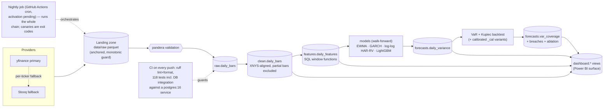

# Volatility Risk Engine

[](https://github.com/aakrisht-26/volatility-risk-engine/actions/workflows/ci.yml)
[](https://github.com/aakrisht-26/volatility-risk-engine/actions/workflows/nightly.yml)

Next-day **volatility forecasting and Value-at-Risk backtesting** for a basket of US
equities and indices: a PostgreSQL pipeline from raw OHLCV to walk-forward forecasts
(EWMA → GARCH(1,1) → HAR-RV → LightGBM), 1-day parametric VaR with Kupiec coverage
tests, and a dashboard-ready SQL surface. Every result below regenerates from the
database by one command.

> **Positioning.** This is a risk analytics project. The intellectual core is the
> distinction that volatility is predictable while returns are not — we forecast risk,
> never direction. Nothing in this repository is a trading signal, a price prediction,
> or investment advice.

## Results — forecast accuracy (ablation)

Five models, walk-forward only (expanding window, ≥3 years of training sessions,
monthly refits) — no random splits, no tuning; every forecast uses information through
the previous session. `lgbm_vix` adds lagged ^VIX level/change as exogenous regressors.

<!-- ABLATION:BEGIN -->
Evaluation set: the per-ticker INTERSECTION of every model's forecast dates — identical for all models by construction: n = 1762 sessions per ticker, 2019-07-15 to 2026-07-17. Realized-variance proxy: Garman-Klass. Lower is better; row-best in bold.

**QLIKE (primary)**

| ticker | ewma_094 | garch_11 | har_rv | lgbm | lgbm_vix |
|---|---|---|---|---|---|
| AAPL | 0.4199 | 0.3945 | **0.3001** | 0.4338 | 0.4075 |
| JPM | 0.3865 | 0.3312 | **0.2842** | 0.4513 | 0.3907 |
| MSFT | 0.4060 | 0.3793 | **0.2820** | 0.4102 | 0.3755 |
| NVDA | 0.4046 | 0.4140 | **0.2846** | 0.3723 | 0.3550 |
| TSLA | 0.3974 | 0.4524 | **0.2746** | 0.3424 | 0.3393 |
| XOM | 0.3371 | 0.3295 | **0.2475** | 0.3485 | 0.3328 |
| ^GSPC | 0.5757 | 0.5057 | **0.3781** | 0.5111 | 0.4493 |
| **AVERAGE** | 0.4182 | 0.4009 | **0.2930** | 0.4099 | 0.3786 |

**RMSE, annualized-vol percentage points (secondary)**

| ticker | ewma_094 | garch_11 | har_rv | lgbm | lgbm_vix |
|---|---|---|---|---|---|
| AAPL | 14.10 | 12.77 | **9.41** | 10.07 | 9.93 |
| JPM | 13.82 | 10.57 | **9.14** | 11.07 | 10.82 |
| MSFT | 13.03 | 11.60 | **8.37** | 9.53 | 9.48 |
| NVDA | 21.62 | 21.03 | **14.56** | 15.38 | 15.25 |
| TSLA | 27.09 | 28.58 | **18.50** | 19.36 | 18.94 |
| XOM | 12.94 | 12.24 | **9.65** | 10.96 | 10.69 |
| ^GSPC | 10.39 | 8.94 | **5.86** | 6.38 | 6.13 |
| **AVERAGE** | 16.14 | 15.11 | **10.78** | 11.82 | 11.61 |

*QLIKE(h, f) = h/f - ln(h/f) - 1 (Patton-class robust loss, normalized to 0 at f = h); dimensionless, lower is better. RMSE is in annualized-volatility percentage points, i.e. rmse(100·sqrt(252·h), 100·sqrt(252·f)). h = realized Garman-Klass variance, f = forecast; both are daily variances in return units.*
<!-- ABLATION:END -->

**Modeling note (why the regressions fit log variance).** v1 fit the regression models
on variance *levels*; in calm regimes they emitted a handful of near-zero (HAR: even
negative, floored) forecasts, and QLIKE — asymmetric by design, punishing variance
under-forecasts hardest, which is the right asymmetry for risk work — blew up on
exactly those dates (JPM HAR-RV: 755.6 with them, 0.29 without). v2 therefore fits
`ln(variance)` and maps back with the lognormal half-variance correction
`exp(m + s^2/2)` (s^2 = training-residual variance in log space, re-estimated at each
refit); raw exponentiation would target the conditional *median* and systematically
under-forecast the mean — the direction QLIKE punishes most. HAR-RV uses Corsi's
log-log form (ln components as regressors, coefficients are elasticities): a log
target over *level* features put spike-day component values straight into the
exponent and produced astronomical over-forecasts — QLIKE's logarithmic over-forecast
penalty barely moved while RMSE detonated, the exact mirror image of the v1 pathology.
LightGBM keeps level features (trees split, they don't extrapolate). The 1e-8
positivity floor remains as a canary only: with log-space fits it should never bind
(expected floored count: 0).

**Proxy robustness** (checked 2026-07-12 on the then-current window). Re-scored against
the noisier squared-return proxy (kept in the features layer for exactly this check),
the ranking flips: GARCH leads (average QLIKE 1.54) and HAR-RV's sweep does not persist
(1.67). The two proxies target different variances — Garman-Klass measures the intraday
range and excludes the overnight gap, while close-to-close squared returns include it —
so each model family wins on the target it trains on. The forecast set feeding the VaR
layer is judged against the VaR-relevant (close-to-close) target, not this table alone.

## Results — VaR coverage (Kupiec backtest)

1-day parametric VaR at 95% and 99% for every model, backtested on the same per-ticker
intersection window as the ablation (n and span are stated in the results block, which
regenerates with the data).

**Method.** VaR_α(d) = z_α · sqrt(var_forecast(d)), assuming a **zero-mean** normal
1-day return — over one trading day the drift (~1e-4) is negligible next to volatility
(~1e-2), the standard 1-day parametric-VaR assumption. z₉₅ = 1.645, z₉₉ = 2.326. VaR is
a positive loss magnitude in log-return units. **Breach convention:** session d breaches
when the realized close-to-close log return r_d < −VaR_α(d) — the long-position loss
tail. Under the model P(breach) = 1 − α exactly, so expected breaches are 5% and 1% of
the window (exact counts in the tables).

**Pre-registered predictions** (committed before any results were computed — see git
history; the results block below was empty in the registering commit):

1. **(i)** The GK-target models (`har_rv`, `lgbm`, `lgbm_vix`) **under-cover at both
   levels** — their σ is *session-range* (Garman–Klass) volatility, which omits the
   overnight gap, so it understates close-to-close risk and produces more breaches than
   nominal.
2. **(ii)** **All models under-cover at 99%** — a normal quantile cannot reach the fat
   tails of real returns, so the 99% VaR is too small for every model.
3. **(iii)** **GARCH and EWMA sit closest to nominal at 95%** — their σ is already
   close-to-close, so at the level where the normal tail is least wrong they should be
   near-calibrated.

**Confirmation criterion for (i)** (pre-registered): the three GK-target models'
*average observed 95% breach rate* ≥ 6.0% (a ≥20% relative excess over the 5% nominal).
If met, the runner builds calibrated variants (`har_rv_cal`, `lgbm_cal`, `lgbm_vix_cal`)
that multiply each session-range variance by a per-ticker ratio
c = mean(r²)/mean(gk_var), estimated on **training data only** at each monthly refit
(expanding window, no look-ahead), converting session-range variance to close-to-close
variance, and re-runs Kupiec on them.

<!-- VAR:BEGIN -->
**Outcomes vs pre-registered predictions:**

- (i) GK-target models under-cover at 95%: **CONFIRMED** — avg breach rate 9.8% vs 5% nominal, all reject Kupiec.
- (ii) All base models under-cover at 99%: **CONFIRMED** — every model's avg 99% rate exceeds 1% (least-bad 1.8%); the normal-quantile fat-tail limitation, measured.
- (iii) GARCH/EWMA closest to nominal at 95%: **CONFIRMED** — their avg 95% rate 5.3% is 0.3pp off nominal vs 4.8pp for the GK-target models.

Backtest window: per-ticker intersection of every base model's forecast dates, n = 1762 sessions, 2019-07-15 to 2026-07-17. Cells show observed breaches (rate); † = Kupiec rejects correct coverage at 5%.

**95% VaR** — expected 88.1 breaches / 1762 sessions

| ticker | ewma_094 | garch_11 | har_rv | lgbm | lgbm_vix |
|---|---|---|---|---|---|
| AAPL | 88 (5.0%) | 85 (4.8%) | 135 (7.7%) † | 186 (10.6%) † | 176 (10.0%) † |
| JPM | 100 (5.7%) | 97 (5.5%) | 129 (7.3%) † | 167 (9.5%) † | 156 (8.9%) † |
| MSFT | 97 (5.5%) | 101 (5.7%) | 151 (8.6%) † | 193 (11.0%) † | 178 (10.1%) † |
| NVDA | 86 (4.9%) | 78 (4.4%) | 139 (7.9%) † | 192 (10.9%) † | 183 (10.4%) † |
| TSLA | 89 (5.1%) | 75 (4.3%) | 146 (8.3%) † | 182 (10.3%) † | 179 (10.2%) † |
| XOM | 100 (5.7%) | 97 (5.5%) | 146 (8.3%) † | 186 (10.6%) † | 190 (10.8%) † |
| ^GSPC | 108 (6.1%) † | 110 (6.2%) † | 166 (9.4%) † | 233 (13.2%) † | 223 (12.7%) † |
| **AVERAGE** | 95.4 | 91.9 | 144.6 | 191.3 | 183.6 |
| **Kupiec rejects (/7)** | 1 | 1 | 7 | 7 | 7 |

**99% VaR** — expected 17.6 breaches / 1762 sessions

| ticker | ewma_094 | garch_11 | har_rv | lgbm | lgbm_vix |
|---|---|---|---|---|---|
| AAPL | 40 (2.3%) † | 31 (1.8%) † | 49 (2.8%) † | 95 (5.4%) † | 90 (5.1%) † |
| JPM | 44 (2.5%) † | 38 (2.2%) † | 56 (3.2%) † | 86 (4.9%) † | 76 (4.3%) † |
| MSFT | 33 (1.9%) † | 38 (2.2%) † | 64 (3.6%) † | 102 (5.8%) † | 94 (5.3%) † |
| NVDA | 23 (1.3%) | 16 (0.9%) | 54 (3.1%) † | 83 (4.7%) † | 74 (4.2%) † |
| TSLA | 30 (1.7%) † | 29 (1.6%) † | 62 (3.5%) † | 101 (5.7%) † | 91 (5.2%) † |
| XOM | 37 (2.1%) † | 36 (2.0%) † | 60 (3.4%) † | 88 (5.0%) † | 96 (5.4%) † |
| ^GSPC | 42 (2.4%) † | 40 (2.3%) † | 76 (4.3%) † | 121 (6.9%) † | 117 (6.6%) † |
| **AVERAGE** | 35.6 | 32.6 | 60.1 | 96.6 | 91.1 |
| **Kupiec rejects (/7)** | 6 | 6 | 7 | 7 | 7 |

**Calibrated GK-target variants** (session-range variance rescaled to close-to-close by the walk-forward, training-only ratio c = mean(r^2)/mean(gk_var)).

*95% VaR — expected 88.1 breaches*

| ticker | har_rv_cal | lgbm_cal | lgbm_vix_cal |
|---|---|---|---|
| AAPL | 65 (3.7%) † | 111 (6.3%) † | 101 (5.7%) |
| JPM | 73 (4.1%) | 103 (5.8%) | 97 (5.5%) |
| MSFT | 89 (5.1%) | 123 (7.0%) † | 119 (6.8%) † |
| NVDA | 70 (4.0%) † | 94 (5.3%) | 88 (5.0%) |
| TSLA | 81 (4.6%) | 118 (6.7%) † | 112 (6.4%) † |
| XOM | 96 (5.4%) | 123 (7.0%) † | 125 (7.1%) † |
| ^GSPC | 78 (4.4%) | 118 (6.7%) † | 117 (6.6%) † |
| **AVERAGE** | 78.9 | 112.9 | 108.4 |
| **Kupiec rejects (/7)** | 2 | 5 | 4 |

*99% VaR — expected 17.6 breaches*

| ticker | har_rv_cal | lgbm_cal | lgbm_vix_cal |
|---|---|---|---|
| AAPL | 24 (1.4%) | 41 (2.3%) † | 43 (2.4%) † |
| JPM | 31 (1.8%) † | 46 (2.6%) † | 40 (2.3%) † |
| MSFT | 31 (1.8%) † | 51 (2.9%) † | 48 (2.7%) † |
| NVDA | 14 (0.8%) | 30 (1.7%) † | 31 (1.8%) † |
| TSLA | 25 (1.4%) | 40 (2.3%) † | 44 (2.5%) † |
| XOM | 30 (1.7%) † | 49 (2.8%) † | 58 (3.3%) † |
| ^GSPC | 29 (1.6%) † | 60 (3.4%) † | 53 (3.0%) † |
| **AVERAGE** | 26.3 | 45.3 | 45.3 |
| **Kupiec rejects (/7)** | 4 | 7 | 7 |
<!-- VAR:END -->

### Independence of breaches (Christoffersen)

Kupiec tests whether breaches happen at the **right rate**; it is blind to *when*.
Eighty-eight breaches spread evenly and eighty-eight all inside one crisis month score
identically. Christoffersen's LR_ind fits a first-order Markov chain to the breach
series and asks whether a breach today is more likely **given a breach yesterday**
(H0: independence, χ²(1)); LR_cc = LR_uc + LR_ind tests rate and clustering jointly
(χ²(2)). Same models, same n = 1,762 intersection window.

**Pre-registered predictions** (Aakrisht's, committed before the statistics were
computed — the results block below was empty in the registering commit):

1. **(i)** GARCH-family models pass independence **more often** than the GK-target
   models, since a conditional-variance recursion adapts within crisis windows.
2. **(ii)** Failures concentrate at **95%**, where breach counts are large enough for
   the test to have power.
3. **(iii)** At **99%** the low counts leave the test underpowered — a non-rejection
   there is not evidence of independence.

<!-- INDEPENDENCE:BEGIN -->
<!-- INDEPENDENCE:END -->

The structural residuals these tables measure (fat tails at 99%, Kupiec's power, the
range-vs-close proxy gap) are consolidated in [Limitations](#limitations).

## What this is

An automated market risk analytics system, built step-by-reviewed-step as a flagship
portfolio project. Daily OHLCV for 8 US tickers (^GSPC, ^VIX, AAPL, MSFT, NVDA, JPM,
XOM, TSLA; fixed inception 2016-07-11) flows through a validated PostgreSQL pipeline
into walk-forward volatility forecasts and coverage-tested VaR. ^VIX is reference data
only — never modeled as a tradable asset. Design values: idempotent loads (upserts on
natural keys, re-running any stage adds zero duplicate rows), unit-explicit schemas,
data-quality **canaries promoted to exit codes**, and results that a stranger can
regenerate from a fresh clone.

## Architecture



**Landing-zone semantics.** The database is the system of record; the parquet landing
zone is deterministic staging reconstructable from the fixed inception anchor (the dev
machine's copy is the durable replay set). A **monotonic guard** refuses any fetch that
would *shrink* a ticker's parquet (`--force` only after investigation); guarded tickers
fall back to a ~5-trading-day trailing-window fetch landed as dated increment files
under `data/raw/increments/` — the anchored zone is never overwritten. Stooq fallback
rows are adjusted-only (`close == adj_close` by policy) and flagged via
`raw.daily_bars.source`.

**Repo invariant: the modeling layer never sees an in-progress bar.** A bar reaches
`clean` — and everything downstream — only after its exchange session has closed. Each
model also emits one flagged **live next-session forecast row** (`is_live`), surfaced
for the dashboard and excluded from every evaluation table (no realized outcome exists).

**Canaries.** Telescoping-identity failures, negative Garman–Klass values (provably
impossible on valid OHLC — a fired canary means bad data leaked past validation),
floored predictions, and GARCH fallback/unconverged refits are all zero in a healthy
run and fail the nightly job loudly when they aren't.

## Dashboard (Step 12 — build in progress)

The Power BI *surface* is live in the database: six views in the `dashboard` schema
(migration 009) so the report re-points from dev Postgres to the cloud by editing two
Power Query parameters. The page-by-page build spec with exact DAX is
[docs/powerbi_spec.md](docs/powerbi_spec.md). Provisional model crown: **har_rv_cal
featured, garch_11 as stated benchmark** — confirmed or flipped on the rendered breach
page (breach *clustering* is the flip signal; Kupiec tests frequency, not independence).

**The PBIX has not been built yet; no dashboard exists to screenshot.** Placeholders:

<!-- SCREENSHOTS:PENDING — when the PBIX pages render, drop images into docs/img/ and
     replace the list items below with ; keep captions. -->
- *(screenshot pending)* **Overview** — live next-session VaR per ticker; featured
  har_rv_cal vs benchmark garch_11; data-freshness cards.
- *(screenshot pending)* **Forecast vs realized** — annualized vol lines per ticker/model.
- *(screenshot pending)* **VaR breach tracker** — returns vs −VaR bands with breach
  markers; cumulative breaches vs expected. The crown page.
- *(screenshot pending)* **Model ablation** — QLIKE/RMSE matrices.
- *(screenshot pending)* **Vol regime timeline** — 21-day vol percentile regimes.

## Automation (Step 11)

> **Status: built and rehearsed end to end — activation pending.** The full nightly job
> ran locally with exit 0, all canaries zero; the scheduled workflow is **deliberately
> disabled** until the Neon activation checklist (recorded in CLAUDE.md) is executed, so
> the Nightly badge above reflects a paused schedule, not a failure. No nightly runs
> are live yet.

<!-- ACTIVATION:PENDING — after the first green scheduled cron run, replace the Status
     blockquote above with:
     > **Status: live.** The nightly job has run on schedule since YYYY-MM-DD (first
     > green cron run: <link to Actions run>); the badge above reflects the latest run.
     Also update the Dashboard section if Power BI has been re-pointed to Neon. -->

A scheduled GitHub Actions job ([nightly.yml](.github/workflows/nightly.yml)) runs the
whole pipeline every trading day: migrate → fetch (full anchored backfill via the
yfinance → Stooq fallback chain) → validate → load → clean → features → all forecasts →
VaR backtest. One command runs it anywhere: `uv run python -m volrisk.ingest.daily_update`.

**Schedule.** `30 22 * * 1-5` (22:30 UTC, Mon–Fri): NYSE closes 16:00 ET = 20:00 UTC
(EDT) / 21:00 UTC (EST), so one year-round cron line gives 1.5–2.5 h of slack for
Yahoo's final daily prints and finishes long before the next open. GitHub auto-disables
scheduled workflows after ~60 days without repo activity; it emails a warning first and
the workflow keeps a `workflow_dispatch` trigger for manual runs and re-enabling.

**Target host: Neon serverless Postgres free tier** (verified from
[neon.com/docs/introduction/plans](https://neon.com/docs/introduction/plans),
2026-07-17): $0/month — 100 CU-hours/project/month (autoscaling up to 2 CU), 0.5 GB
storage/project, 5 GB egress/month, scale-to-zero after 5 min. **Known edge:**
exhausting CU-hours or egress suspends compute until the next billing period; our
footprint sits at roughly 10% of the allowances, so the cutoff is documented, not
expected. Local Postgres on port 5433 remains the dev/test DB; the cloud DB is seeded
by **replaying the pipeline from the anchor**, which doubles as the landing-zone
replayability proof.

## Setup — from a fresh clone

Prerequisites: [uv](https://docs.astral.sh/uv/getting-started/installation/), git, and
a PostgreSQL 16 you can create databases on (two routes below). Python itself is
handled by uv via `.python-version`.

```bash
git clone https://github.com/aakrisht-26/volatility-risk-engine.git
cd volatility-risk-engine
uv sync                       # ~1 min first time: creates .venv from uv.lock
uv run pre-commit install     # optional: ruff hooks on commit
cp .env.example .env          # then edit: set DATABASE_URL (see below)
```

**Postgres route A — native.** Install PostgreSQL 16 (Windows: the EDB installer; if
another Postgres owns 5432, install on 5433 and use that port in `DATABASE_URL`), then:

```sql
CREATE ROLE volrisk LOGIN PASSWORD '...';
CREATE DATABASE volrisk OWNER volrisk;
CREATE DATABASE volrisk_test OWNER volrisk;   -- disposable, for integration tests
```

**Postgres route B — Docker.** `docker compose up -d` starts postgres:16 with
credentials from `.env`; `docker compose ps` until healthy.

**Run the pipeline** (times from a mid-range machine; LightGBM stage scales with CPU):

| command | does | takes | "good" looks like |
|---|---|---|---|
| `uv run python -m volrisk.db.migrate` | apply `db/migrations/*.sql`, tracked | seconds | lists applied versions, then `none (up to date)` on re-run |
| `uv run python -m volrisk.ingest.backfill` | OHLCV since 2016-07-11 → `data/raw/*.parquet` | ~30 s | per-ticker row counts, "fixed inception" banner, no GUARDED lines |
| `uv run python -m volrisk.db.load_raw` | upsert parquet → `raw.daily_bars` | ~5 s | re-run prints `net new rows: 0` |
| `uv run python -m volrisk.transform.cleaning` | calendar-align → `clean.daily_bars` | ~5 s | gap report reconciles (sessions = bars − partials); telescoping `OK` ×8 |
| `uv run python -m volrisk.features.build` | SQL window functions → `features.daily_features` | ~3 s | `negative_gk` = 0 on every ticker |
| `uv run python -m volrisk.features.crosscheck` | SQL vs pandas recomputation | ~5 s | `all 14 columns within 1e-12` |
| `uv run python -m volrisk.models.baselines` | walk-forward EWMA + GARCH | ~30 s | `GARCH convergence: … 0 fallback(s)` |
| `uv run python -m volrisk.models.feature_models` | walk-forward HAR-RV + LightGBM (+VIX) | 4–13 min | `floored predictions (canary…): 0`; HAR elasticities ≈ 0.2–0.4 |
| `uv run python -m volrisk.evaluate.ablation --write-readme` | QLIKE/RMSE → DB + README | ~5 s | the ablation tables above |
| `uv run python -m volrisk.risk.backtest --write-readme` | VaR + Kupiec → DB + README | ~10 s | the coverage tables above, 3× CONFIRMED |
| `uv run --env-file .env pytest` | full suite incl. DB integration | ~30–60 s | `118 passed` (without `.env`, DB tests skip: `104 passed, 14 skipped`) |

Or everything at once, exactly as the nightly job runs it:
`uv run python -m volrisk.ingest.daily_update` → ends `nightly job OK` with all
canaries zero (~5–15 min, machine-dependent).

## India NSE audit (Step 10 — audited, integration deferred)

A conditional data-quality gate on the Phase-2 basket (^NSEI, RELIANCE.NS, HDFCBANK.NS,
INFY.NS, TCS.NS) — **an audit only; nothing is integrated.** Run with
`uv run python -m volrisk.audit.nse`. **Audited 2026-07-13**; bar counts reflect that
fetch date.

| ticker | bars | gap rate¹ | special sessions² | zero-volume | close/adj (today) | split jumps³ | verdict |
|---|---|---|---|---|---|---|---|
| ^NSEI | 2,463 | 0.36% | 6 | 1.2% | 1.0000 | 0 | GO |
| RELIANCE.NS | 2,472 | 0.20% | 11 | 0.2% | 1.0000 | 0 | GO |
| HDFCBANK.NS | 2,472 | 0.20% | 11 | 0.2% | 1.0000 | 0 | GO |
| INFY.NS | 2,472 | 0.20% | 11 | 0.2% | 1.0000 | 0 | GO |
| TCS.NS | 2,472 | 0.20% | 11 | 0.2% | 1.0000 | 0 | GO |

¹ calendar sessions with no bar / expected. ² bars on days the calendar marks closed.
³ single-day raw moves >35% — a nonzero count would flag an *unadjusted* corporate action.

Adjustment is clean (every known bonus/split back-adjusted, zero split-sized jumps
across 40 stock-years). The one real caveat is **calendar metadata, not prices**: the
`XNSE` calendar omits real NSE sessions (Diwali Muhurat, Budget Saturdays) and missed
ad-hoc closures (2024-01-22 Ram Mandir, 2024-11-20 Maharashtra elections) — the price
data tracks real NSE days *more* accurately than the calendar. Since the cleaning stage
excludes non-session rows, integration needs a calendar decision first (preferred:
augment `XNSE`); **GO on data quality, integration deferred.**

## Limitations

Honest residuals, each measured or dated rather than asserted:

1. **Normal quantiles cannot reach real tails — measured.** Every model under-covers at
   99%: the best base model (garch_11) breaches 1.85% of sessions vs 1% nominal, and
   even the best calibrated model (har_rv_cal) 1.49% — Kupiec still rejects 6/7 and 4/7
   tickers respectively. Calibration fixes the *variance level*, not the *tail shape*.
   Student-t innovations are the documented stretch fix.
2. **Kupiec's POF test has low power at 99%** with n ≈ 1,760 (~17.6 expected breaches):
   non-rejection there is weak evidence, not proof. Kupiec also tests *frequency* only —
   the **Christoffersen independence test** (breach clustering) is a recorded stretch item.
3. **Range vs close-to-close variance are different targets.** Garman–Klass measures the
   intraday session range and omits the overnight gap; model rankings flip with the
   evaluation proxy (see Proxy robustness above). This gap is why the `_cal` calibration
   layer exists at all.
4. **The calibration factor is largest for the index — observed.** Measured 2026-07-20
   as avg(`har_rv_cal`)/avg(`har_rv`) variance over all settled rows: **^GSPC 2.045×**
   vs 1.51–1.77× for the single names (AAPL 1.77, NVDA 1.73, TSLA 1.71, JPM 1.64,
   MSFT 1.61, XOM 1.51). The likely mechanism — stated as a hypothesis, not proven —
   is that an index's high/low understates true dispersion because constituents don't
   hit their extremes simultaneously, so range-based estimators under-measure *index*
   variance most.
5. **XNYS is a proxy calendar for ^VIX** (CBOE-listed) — a deliberate simplification
   whose artifacts (e.g. a phantom ^VIX bar on Memorial Day 2026) are surfaced and
   excluded by the gap report, not silently absorbed.
6. **yfinance's "Close" is already split-adjusted** (only dividends separate it from
   "Adj Close"); Stooq fallback rows are fully adjusted-only (`close == adj_close`),
   flagged via `raw.daily_bars.source`.
7. **US-only scope.** The NSE basket passed its data-quality audit (2026-07-13) and is
   deferred pending calendar handling — see the audit section.
8. **Monthly refit cadence.** Model parameters update at calendar-month boundaries, not
   daily; within a month, a regime break is absorbed only through the variance recursion
   or features, not re-estimated parameters.
9. **No transaction costs, liquidity, or portfolio effects.** VaR is computed for a unit
   long position per name; there is no portfolio aggregation, netting, or cost model.

## Stack

Python 3.12 managed with [uv](https://docs.astral.sh/uv/) · PostgreSQL 16 · SQLAlchemy 2 +
psycopg 3 · pandas / numpy · pandera · arch · scikit-learn · LightGBM ·
pandas-market-calendars · pytest · ruff · GitHub Actions · Power BI (build in progress)

Roadmap, working agreements, and every recorded decision: [CLAUDE.md](CLAUDE.md).
Dashboard build spec: [docs/powerbi_spec.md](docs/powerbi_spec.md).
